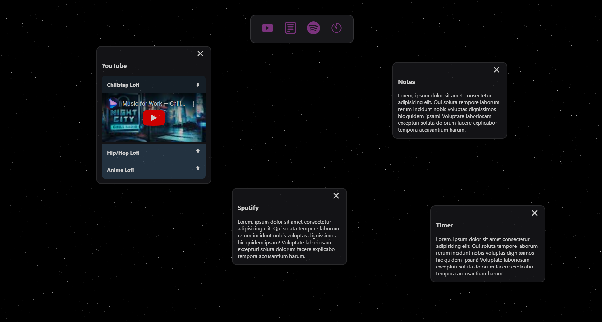

# solarstudy

<!-- ABOUT THE PROJECT -->

## About The Project

Solar Study:

- This projects mission is to boost your workspace making a more productive environment
- Condensing youre work necessities in 1 place making it easier to focus on your WORK
- Will include Timers, music integration, notepads

### Built With

Project is built with following frameworks/libraries/tools. Will add more as the project continues.

- [![Vite][Vitejs.dev]][Vite-url]
- [![React][React.dev]][React-url]
- [![Redux][Redux.js.org]][Redux-url]

[React.dev]: https://img.shields.io/badge/React-20232A?style=for-the-badge&logo=react&logoColor=61DAFB
[React-url]: https://reactjs.org/
[Vitejs.dev]: https://img.shields.io/badge/Vite-7851A9?style=for-the-badge&logo=Vite&logoColor=yellow
[Vite-url]: https://vitejs.dev/
[Redux.js.org]: https://img.shields.io/badge/Redux-ffffff?style=for-the-badge&logo=Redux&logoColor=764abc
[Redux-url]: https://redux.js.org/
